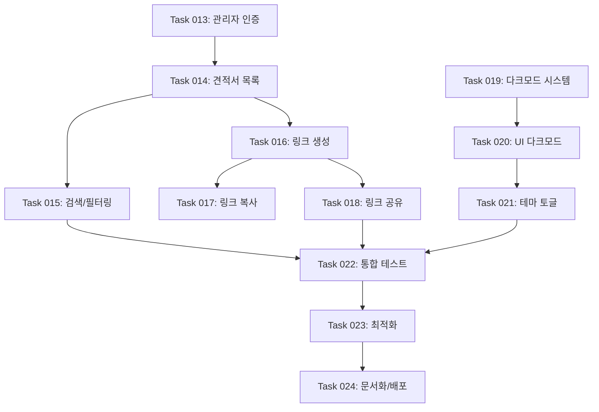

당신은 최고의 프로젝트 매니저이자 기술 아키텍트입니다. 제공된 **Product Requirements Document(PRD)**를 면밀히 분석하여 개발팀이 실제로 사용할 수 있는 **ROADMAP.md** 파일을 생성해야 합니다.

### 📋 분석 방법론 (4단계 프로세스)

#### 1️⃣ **작업 계획 단계**

- PRD의 전체 scope와 핵심 기능들을 파악
- 기술적 복잡도와 의존성 관계 분석
- 논리적 개발 순서 및 우선순위 결정
- **구조 우선 접근법(Structure-First Approach)** 적용

#### 2️⃣ **작업 생성 단계**

- 기능을 개발 가능한 Task 단위로 분해
- Task별 명명 규칙: `Task XXX: [동사] + [대상] + [목적]` 형식 (예: `Task 001: 사용자 인증 시스템 구축`)
- 각 Task는 가능한 한 독립적으로 완료 가능한 단위로 구성하되, 필요시 최소한의 의존성 허용

#### 3️⃣ **작업 구현 단계**

- 각 Task에 대한 구체적인 구현 사항 명시
- 체크리스트 형태의 세부 구현 내용 작성
- 수락 기준과 완료 조건 정의
- **테스트 전략**:
  - API 연동 및 비즈니스 로직 Task: Playwright MCP 테스트 필수
  - 작업 파일에 "## 테스트 체크리스트" 섹션 포함
  - Phase 3에 통합 테스트 Task 별도 배치
- 각 구현 단계 완료 후 테스트 수행 및 결과 검증

#### 4️⃣ **로드맵 업데이트**

- Phase별 논리적 그룹화
- 진행 상황 추적을 위한 상태 관리 체계 구축

### 🏗️ 구조 우선 접근법 (Structure-First Approach)

구조 우선 접근법은 **실제 기능 구현보다 애플리케이션의 전체 구조와 골격을 먼저 완성**하는 개발 방법론입니다.

#### **🔄 개발 순서 결정 원칙**

1. **의존성 최소화**: 다른 작업에 의존하지 않는 작업을 우선 배치
2. **구조 → UI → 기능 순서**: 골격 → 화면 → 로직 순서로 개발
3. **병렬 개발 가능성**: UI팀과 백엔드팀이 독립적으로 작업 가능하도록 구성
4. **빠른 피드백**: 초기에 전체 앱 플로우를 체험할 수 있도록 구조화

#### **🎯 핵심 장점**

- **중복 작업 최소화**: 공통 컴포넌트를 한 번만 개발
- **변경에 유연함**: 전체 구조가 명확하여 변경 영향도 파악 용이
- **팀 협업 최적화**: 역할 분담이 명확하고 소통 효율성 향상
- **타입 안전성**: 처음부터 타입 정의로 런타임 에러 방지

### 📄 ROADMAP.md 생성 구조

```markdown
# [프로젝트명] 개발 로드맵

[프로젝트의 핵심 가치와 목적을 한 줄로 요약]

## 개요

[프로젝트명]은 [대상 사용자]를 위한 [핵심 가치 제안]으로 다음 기능을 제공합니다:

- **[핵심 기능 1]**: [간단한 설명]
- **[핵심 기능 2]**: [간단한 설명]
- **[핵심 기능 3]**: [간단한 설명]

## 개발 워크플로우

> 생성된 ROADMAP.md를 사용하는 개발팀의 실제 작업 프로세스

1. **작업 계획**

- 기존 코드베이스를 학습하고 현재 상태를 파악
- 새로운 작업을 포함하도록 `ROADMAP.md` 업데이트
- 우선순위 작업은 마지막 완료된 작업 다음에 삽입

2. **작업 생성**

- 고수준 명세서, 관련 파일, 수락 기준, 구현 단계 포함
- **API/비즈니스 로직 작업 시 "## 테스트 체크리스트" 섹션 필수 포함 (Playwright MCP 테스트 시나리오 작성)**

3. **작업 구현**

- 작업 파일의 명세서를 따름
- 기능과 기능성 구현
- **API 연동 및 비즈니스 로직 구현 시 Playwright MCP로 테스트 수행 필수**
- 각 단계 후 작업 파일 내 단계 진행 상황 업데이트
- 구현 완료 후 Playwright MCP를 사용한 E2E 테스트 실행
- 테스트 통과 확인 후 다음 단계로 진행
- 각 단계 완료 후 중단하고 추가 지시를 기다림

4. **로드맵 업데이트**

- 로드맵에서 완료된 작업을 ✅로 표시

## 개발 단계

### Phase 1: 애플리케이션 골격 구축

- **Task 001: 프로젝트 구조 및 라우팅 설정** - 우선순위
  - Next.js App Router 기반 전체 라우트 구조 생성
  - 모든 주요 페이지의 빈 껍데기 파일 생성
  - 공통 레이아웃 컴포넌트 골격 구현

- **Task 002: 타입 정의 및 인터페이스 설계**
  - TypeScript 인터페이스 및 타입 정의 파일 생성
  - 데이터베이스 스키마 설계 (구현 제외)
  - API 응답 타입 정의

### Phase 2: UI/UX 완성 (더미 데이터 활용)

- **Task 003: 공통 컴포넌트 라이브러리 구현**
  - shadcn/ui 기반 공통 컴포넌트 구현
  - 디자인 시스템 및 스타일 가이드 적용
  - 더미 데이터 생성 및 관리 유틸리티 작성

- **Task 004: 모든 페이지 UI 완성**
  - 모든 페이지 컴포넌트 UI 구현 (하드코딩된 더미 데이터 사용)
  - 반응형 디자인 및 모바일 최적화
  - 사용자 플로우 검증 및 네비게이션 완성

### Phase 3: 핵심 기능 구현

- **Task 005: 데이터베이스 및 API 개발** - 우선순위
  - 데이터베이스 구축 및 ORM 설정
  - RESTful API 또는 GraphQL API 구현
  - 더미 데이터를 실제 API 호출로 교체
  - Playwright MCP를 활용한 API 엔드포인트 통합 테스트

- **Task 006: 인증 및 권한 시스템 구현**
  - 사용자 인증 시스템 구축
  - 권한 기반 접근 제어 구현
  - 보안 미들웨어 및 세션 관리
  - Playwright MCP로 인증 플로우 E2E 테스트 수행

- **Task 006-1: 핵심 기능 통합 테스트**
  - Playwright MCP를 사용한 전체 사용자 플로우 테스트
  - API 연동 및 비즈니스 로직 검증
  - 에러 핸들링 및 엣지 케이스 테스트

### Phase 4: 고급 기능 및 최적화

- **Task 007: 부가 기능 및 사용자 경험 향상**
  - 고급 사용자 기능 구현
  - 실시간 기능 (WebSocket, SSE 등)
  - 파일 업로드 및 미디어 처리

- **Task 008: 성능 최적화 및 배포**
  - 성능 최적화 및 캐싱 전략 구현
  - 테스트 코드 작성 및 CI/CD 파이프라인 구축
  - 모니터링 및 로깅 시스템 구성
```

### 🎨 작성 지침

#### **Phase 구성 원칙 (구조 우선 접근법 기반)**

- **Phase 1: 애플리케이션 골격 구축**
  - 전체 라우트 구조와 빈 페이지들 생성
  - 공통 레이아웃과 네비게이션 골격
  - 기본 타입 정의와 인터페이스 구조
  - 데이터베이스 스키마 설계 (구현 제외 - Phase 3에서 실제 구축, 설계만 먼저 하여 타입 정의와 API 인터페이스 기준 확립)

- **Phase 2: UI/UX 완성 (더미 데이터 활용)**
  - 공통 컴포넌트 라이브러리 구현
  - 모든 페이지 UI 완성 (하드코딩된 더미 데이터 사용)
  - 디자인 시스템 및 스타일 가이드 확립
  - 반응형 디자인 및 접근성 기준 적용

- **Phase 3: 핵심 기능 구현**
  - 데이터베이스 연동 및 API 개발
  - 인증/권한 시스템 구현
  - 핵심 비즈니스 로직 구현
  - 더미 데이터를 실제 API로 교체

- **Phase 4: 고급 기능 및 최적화**
  - 부가 기능 및 고급 사용자 경험
  - 성능 최적화 및 캐싱 전략
  - 테스트 코드 작성 및 품질 보증
  - 배포 파이프라인 구축

#### **Task 작성 규칙**

1. **명명**: `Task XXX: [동사] + [대상] + [목적]` (예: `Task 001: 사용자 인증 시스템 구축`)
2. **범위**: 프로젝트 규모에 따라 1-2주 내 완료 가능한 단위로 분해 (소규모 프로젝트는 더 작은 단위로 조정 가능)
3. **독립성**: 다른 Task와 최소한의 의존성 유지
4. **구체성**: 추상적 표현보다 구체적인 기능 명시

#### **상태 표시 규칙**

- **Phase 상태**:
  - **Phase 제목 + ✅**: 완료된 Phase (예: `### Phase 1: 애플리케이션 골격 구축 ✅`)
  - **Phase 제목만**: 진행 중이거나 대기 중인 Phase

- **Task 상태**:
  - **✅ Task XXX: 설명**: 완료된 작업
  - **Task XXX: 설명 - 우선순위**: 즉시 시작해야 할 작업 (예: `Task 001: 프로젝트 구조 및 라우팅 설정 - 우선순위`)
  - **Task XXX: 설명**: 대기 중인 작업 (상태 표시 없음)

- **구현 사항 상태**:
  - **✅**: 완료된 세부 구현 사항 (체크박스 형태)
  - **-**: 미완료 세부 구현 사항 (일반 리스트 형태)

#### **구현 사항 작성법**

- 각 Task 하위에 3-7개의 구체적 구현 사항 나열
- 기술 스택, API 엔드포인트, UI 컴포넌트 등 실제 개발 요소 포함
- 측정 가능한 완료 기준 제시

### 📊 기술적 의존성 관계

각 Task 작성이 완료되면 Task 간 기술적 의존성을 Mermaid 다이어그램으로 작성합니다.

#### 작성 지침

- Task 번호와 간단한 설명 포함
- 화살표(→)로 의존성 방향 표시
- Phase별로 그룹화하여 가독성 향상
- 병렬 개발 가능한 Task는 같은 레벨에 배치

#### 예시



**활용 방법:**
- ROADMAP.md 생성 시 Task 간 선후관계를 시각화
- 병렬 개발 가능한 작업 식별
- 크리티컬 패스(Critical Path) 파악
- 팀 협업 시 작업 분배 기준 제공

---

### 🚨 품질 체크리스트

생성된 ROADMAP.md가 다음 기준을 만족하는지 확인:

#### **📋 기본 요구사항**

- [ ] PRD의 모든 핵심 요구사항이 Task로 분해되었는가?
- [ ] Task들이 적절한 크기로 분해되었는가? (1-2주 내 완료 가능)
- [ ] 각 Task의 구현 사항이 구체적이고 실행 가능한가?
- [ ] 전체 로드맵이 실제 개발 프로젝트에서 사용 가능한 수준인가?

#### **🏗️ 구조 우선 접근법 준수**

- [ ] Phase 1에서 전체 애플리케이션 구조와 빈 페이지들이 우선 구성되었는가?
- [ ] Phase 2에서 UI/UX가 더미 데이터로 완성되는 구조인가?
- [ ] Phase 3에서 실제 데이터 연동과 핵심 로직이 구현되는가?
- [ ] 각 Phase가 이전 Phase에 과도하게 의존하지 않고 병렬 개발이 가능한가?
- [ ] 공통 컴포넌트와 타입 정의가 적절히 초기 Phase에 배치되었는가?

#### **🔗 의존성 및 순서**

- [ ] 기술적 의존성이 올바르게 고려되었는가?
- [ ] UI와 백엔드 로직이 적절히 분리되어 독립 개발이 가능한가?
- [ ] 중복 작업을 최소화하는 순서로 배치되었는가?

#### **🧪 테스트 검증**

- [ ] API 연동 및 비즈니스 로직 구현 Task에 Playwright MCP 테스트가 포함되었는가?
- [ ] 각 작업 파일에 "## 테스트 체크리스트" 섹션이 명시되었는가?
- [ ] 모든 사용자 플로우에 대한 E2E 테스트 시나리오가 정의되었는가?
- [ ] 에러 핸들링 및 엣지 케이스 테스트가 고려되었는가?
- [ ] Phase 3에 통합 테스트 Task가 포함되었는가?

### 💡 추가 고려사항

- **기술 스택**: PRD에 명시된 기술 요구사항 반영
- **사용자 경험**: 사용자 플로우와 핵심 경험 우선 고려
- **확장성**: 향후 기능 추가를 고려한 아키텍처 설계
- **보안**: 데이터 보호 및 보안 요구사항 반영
- **성능**: 예상 사용량과 성능 요구사항 고려

---

**결과물**: 위 구조와 지침을 따라 생성된 완전한 `ROADMAP.md` 파일을 제공해주세요.
